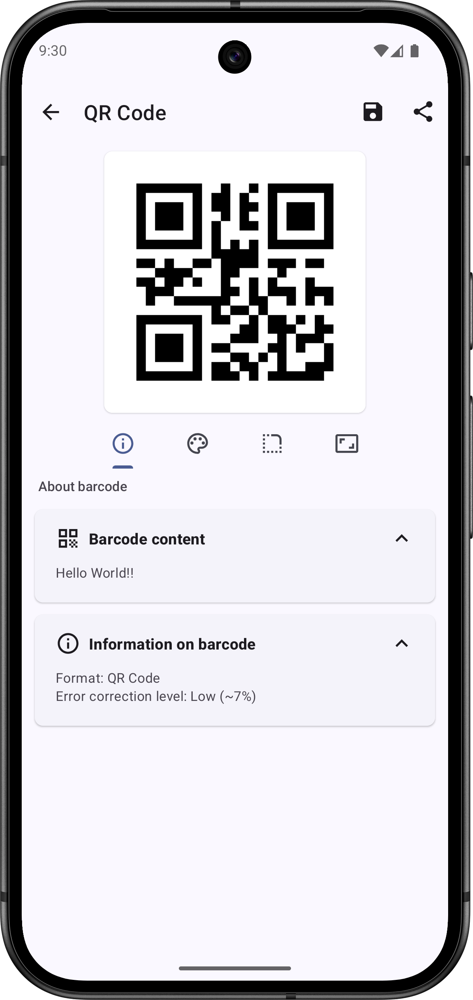
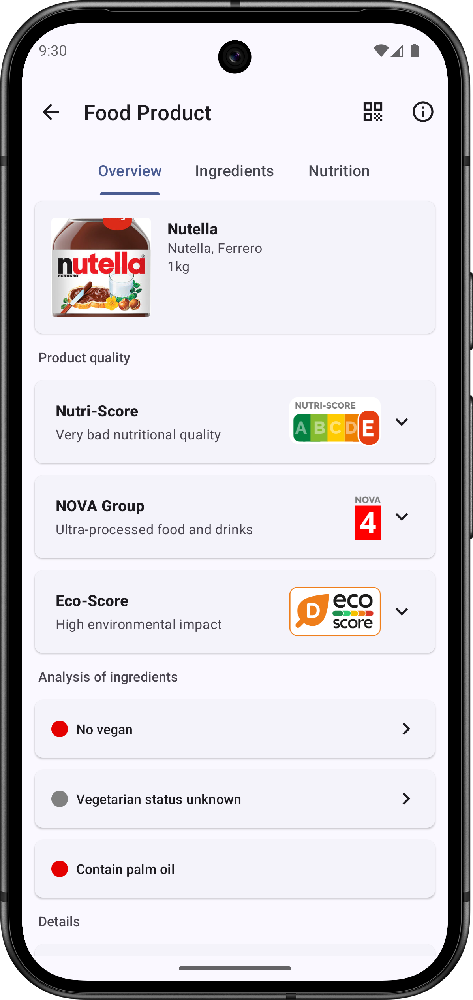
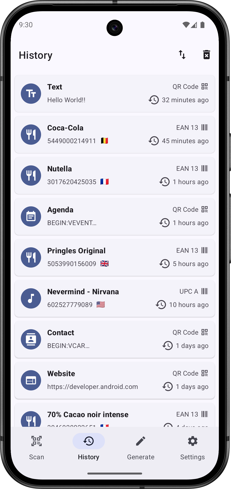
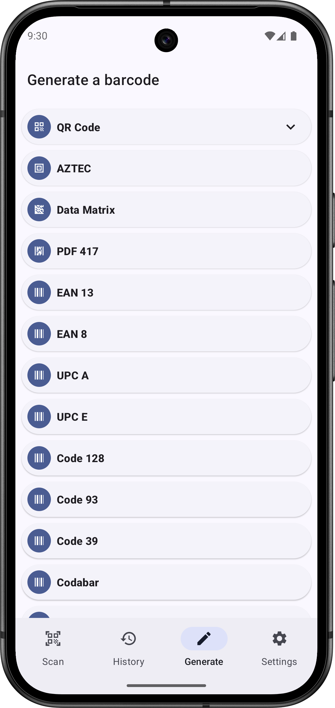
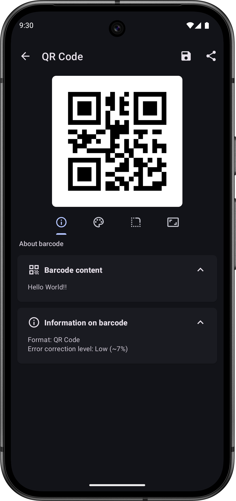
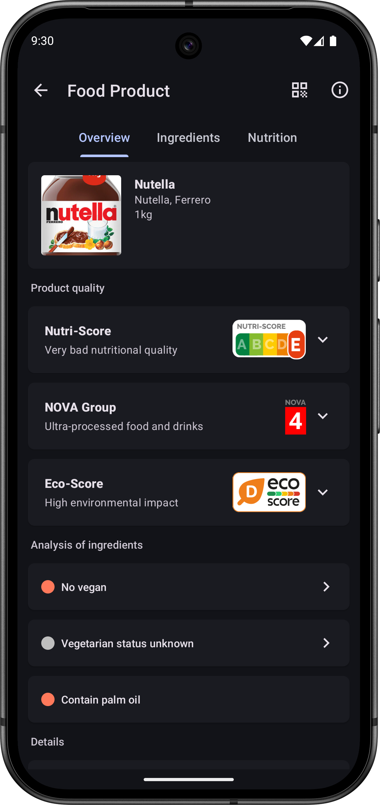
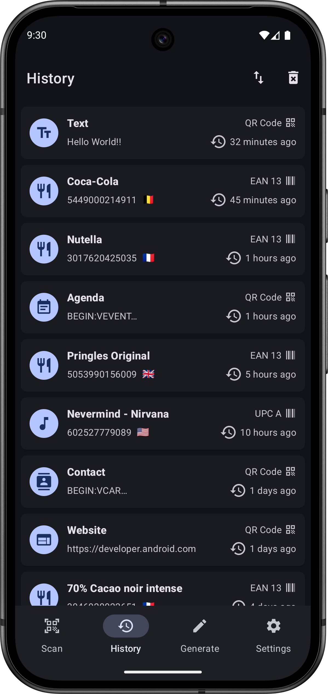
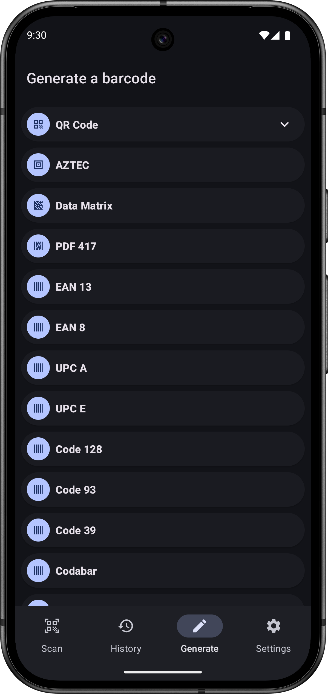

<div align="center"></div>

## <div align="center">Barcode Scanner</div>

<div align="center"><h4>An open-source app that allows you to read and generate barcodes for Android.</h4></div>

<div align="center">
    <a href="https://f-droid.org/packages/com.atharok.barcodescanner/" target="_blank"></a>
    <a href="https://play.google.com/store/apps/details?id=com.atharok.barcodescanner" target="_blank"></a>
    <a href="https://www.amazon.com/Atharok-Barcode-Scanner/dp/B0BCDZ19T2" target="_blank"></a>
</div>

You may also download the APK directly from [GitLab](https://gitlab.com/Atharok/BarcodeScanner/-/releases).

[](https://www.gnu.org/licenses/gpl-3.0)

## Overview

Barcode Scanner is a free and open-source app that allows you to read and generate barcodes. This app respects your privacy. It does not contain any trackers and does not collect any data.

## Formats

Different barcode formats are supported:

- 2D barcode format: ***QR Code, Data Matrix, PDF 417, AZTEC***
- 1D barcode format: ***EAN 13, EAN 8, UPC A, UPC E, Code 128, Code 93, Code 39, Codabar, ITF***

## Services

Get information about a product during a scan:

- Food Products with [Open Food Facts](https://world.openfoodfacts.org/)
- Cosmetic Products with [Open Beauty Facts](https://world.openbeautyfacts.org/)
- Pet Food Products with [Open Pet Food Facts](https://world.openpetfoodfacts.org/)
- Books with [Open Library](https://openlibrary.org/)
- Music (CDs, Vinyls...) with [MusicBrainz](https://musicbrainz.org/)

## App features

- Simply point your smartphone's camera to a barcode and instantly receive information about it. You can also scan barcodes through a picture in your smartphone.
- With a simple scan, read business cards, add new contacts, add new events to your agenda, open URL or even connect to Wi-Fi.
- Scan Food products barcodes to receive information about their composition thanks to the databases Open Food Facts and Open Beauty Facts.
- Search information about the product you scan, with a quick research on different websites such as Amazon or Fnac.
- Keep track of all your scanned barcodes with the history tool.
- Generate your own barcodes.
- Customize the interface with different colors, with a light theme or a dark one. The interface is built with Material 3 and is compatible with Material You, allowing you to adjust colors based on your wallpaper for devices running on Android 12 or later.
- Texts are entirely translated in English, Arabic, Spanish, French, Portuguese, Russian, German, Turkish, Italian, Ukrainian, Polish, Dutch, Romanian and Chinese (Simplified and Traditional).

## Screenshots










## Donate

If you like Barcode Scanner, you can support me via [Liberapay](https://liberapay.com/Atharok/donate) or [Ko-fi](https://ko-fi.com/atharok).

[](https://liberapay.com/Atharok/donate)
[](https://ko-fi.com/atharok)

## Translation

If you want to translate Barcode Scanner, you can use [Weblate](https://hosted.weblate.org/projects/barcodescanner/) or make a merge request.

## Checksums

To verify the authenticity and integrity of the APK, compare its signature against the certificate fingerprints shown below:

```
SHA-256: 7ef567187de762dcc47116366e20c08c4673f68d445340673b72c42120ff40c7
SHA-1: 4d0484ab1a4da71a2fea2e53d134d4e3839440ed
MD5: 8d327b5dc6509672426d12bb47ae8012
```

Notes about third-party distribution platforms:

- Google Play: The app is re-signed by Google with its own key, so the certificate fingerprints will differ.
- F-Droid: The app is built from source and signed by F-Droid with its own key, so the certificate fingerprints will also differ.

## Licences

The code is licensed under the [GPLv3](https://www.gnu.org/licenses/gpl-3.0).

Dependencies:


- [Activity KTX](https://github.com/androidx/androidx) is licensed under [Apache License 2.0](https://www.apache.org/licenses/LICENSE-2.0) by Google
- [Preference KTX](https://github.com/androidx/androidx) is licensed under [Apache License 2.0](https://www.apache.org/licenses/LICENSE-2.0) by Google
- [Lifecycle Livedata KTX](https://github.com/androidx/androidx) is licensed under [Apache License 2.0](https://www.apache.org/licenses/LICENSE-2.0) by Google
- [AppCompat](https://github.com/androidx/androidx) is licensed under [Apache License 2.0](https://www.apache.org/licenses/LICENSE-2.0) by Google
- [ConstraintLayout](https://github.com/androidx/androidx) is licensed under [Apache License 2.0](https://www.apache.org/licenses/LICENSE-2.0) by Google
- [RecyclerView](https://github.com/androidx/androidx) is licensed under [Apache License 2.0](https://www.apache.org/licenses/LICENSE-2.0) by Google
- [Material Components for Android](https://github.com/material-components/material-components-android) is licensed under [Apache License 2.0](https://www.apache.org/licenses/LICENSE-2.0) by Material Components
- [CameraX](https://github.com/androidx/androidx) is licensed under [Apache License 2.0](https://www.apache.org/licenses/LICENSE-2.0) by Google
- [Room](https://github.com/androidx/androidx) is licensed under [Apache License 2.0](https://www.apache.org/licenses/LICENSE-2.0) by Google
- [Retrofit](https://github.com/square/retrofit) is licensed under [Apache License 2.0](https://www.apache.org/licenses/LICENSE-2.0) by Square
- [Gson](https://github.com/google/gson) is licensed under [Apache License 2.0](https://www.apache.org/licenses/LICENSE-2.0) by Google
- [Coil](https://github.com/coil-kt/coil) is licensed under [Apache License 2.0](https://www.apache.org/licenses/LICENSE-2.0) by coil-kt
- [Koin](https://github.com/InsertKoinIO/koin) is licensed under [Apache License 2.0](https://www.apache.org/licenses/LICENSE-2.0) by insert-koin.io
- [ZXing](https://github.com/zxing/zxing) is licensed under [Apache License 2.0](https://www.apache.org/licenses/LICENSE-2.0) by Zxing
- [zxing-cpp](https://github.com/zxing-cpp/zxing-cpp) is licensed under [Apache License 2.0](https://www.apache.org/licenses/LICENSE-2.0) by Axel Waggershauser
- [OpenCV](https://github.com/opencv/opencv) and [opencv_contrib](https://github.com/opencv/opencv_contrib) are licensed under [Apache License 2.0](https://www.apache.org/licenses/LICENSE-2.0) by OpenCV
- [WeChat QRCode models](https://github.com/WeChatCV/opencv_3rdparty/tree/wechat_qrcode) are licensed under [Apache License 2.0](https://www.apache.org/licenses/LICENSE-2.0) by Tencent
- [Android Image Cropper](https://github.com/CanHub/Android-Image-Cropper) is licensed under [Apache License 2.0](https://www.apache.org/licenses/LICENSE-2.0) by CanHub
- [ez-vcard](https://github.com/mangstadt/ez-vcard) is licensed under [FreeBSD](https://www.freebsd.org/copyright/freebsd-license/) by Michael Angstadt
- [Color Picker](https://github.com/Atharok/ColorPicker) is licensed under [Apache License 2.0](https://www.apache.org/licenses/LICENSE-2.0) by Atharok

Images:

- [Material icons](https://fonts.google.com/icons) are licensed under [Apache License 2.0](https://www.apache.org/licenses/LICENSE-2.0)
- [Images of the flags](https://www.drapeauxdespays.fr) are in the public domain
